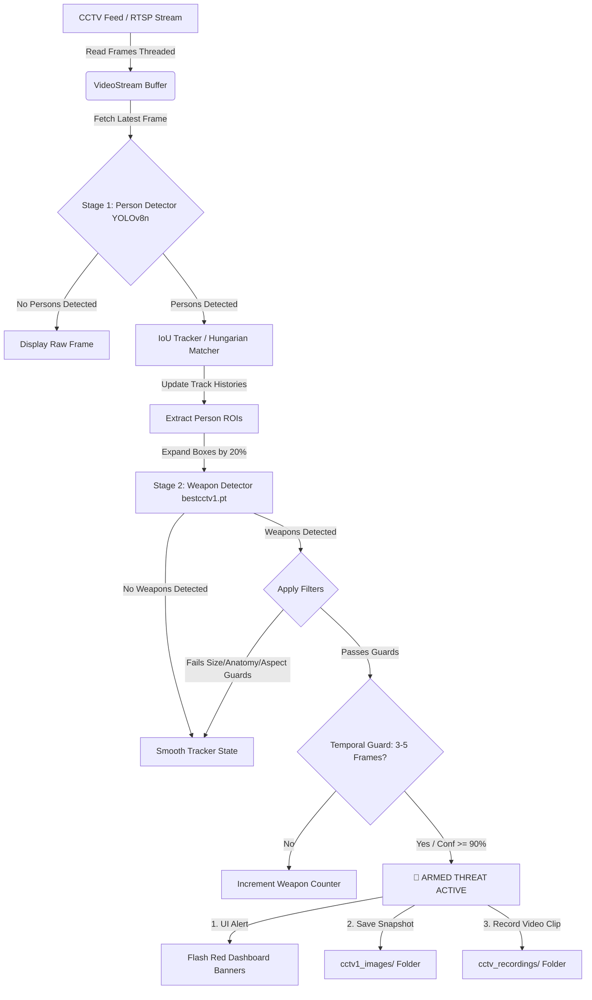

# SMS Vision AI: High-Performance Weapon Detection System
## System Architecture & Technical Documentation

This document provides a comprehensive technical overview of the SMS Vision AI Weapon Detection System. It covers the two-stage detection pipeline, tracking mechanics, temporal/anatomical filters, Flask-based dashboard features, and instructions on how to run and customize the project.

---

## 1. System Architecture Overview

The system is designed to perform real-time, low-latency weapon detection on high-definition CCTV feeds (such as Hikvision or Dahua RTSP streams). 

To balance computational efficiency and high accuracy, the system employs a **Two-Stage Detection Pipeline** combined with an **Intersection over Union (IoU) Tracker** and a series of **False-Positive Guards**.



---

## 2. The Two-Stage Detection Pipeline

Running high-resolution object detection on an entire CCTV frame is computationally expensive and leads to low frame rates (FPS). Conversely, running a model at a low resolution makes it impossible to detect small objects like handguns or knives. 

The **Two-Stage Pipeline** solves this dilemma:

| Pipeline Stage | Model Used | Input Resolution | Purpose | Output |
| :--- | :--- | :--- | :--- | :--- |
| **Stage 1: Person Detection** | `yolov8n.pt` (Nano) | `256 x 256` | Broad scan to locate people in the frame at maximum speed. | Coordinates of human bounding boxes. |
| **Stage 2: Weapon Detection** | `models/bestcctv1.pt` (Custom) | `640 x 640` | Focused, high-resolution scan on cropped person areas. | Weapon bounding boxes and confidence scores. |

### ROI (Region of Interest) Expansion
When a person is detected in Stage 1, their bounding box is expanded by **20%** (`EXPANSION_FACTOR = 0.2`). This ensures that if the person is reaching out or holding a weapon at arm's length, the weapon remains inside the cropped area fed into Stage 2.

---

## 3. Object Tracking (`tracker.py`)

CCTV feeds often suffer from noise, frame drops, or brief occlusions (e.g., a person walking behind a pillar). A raw detection pipeline without tracking would drop and recreate alarms constantly. 

The system uses a custom **IoU Track Manager** to maintain continuity:
* **Hungarian Algorithm Matching**: Compares current person detections with historical tracks using a cost function based on bounding box IoU, centroid distance, size consistency, and velocity direction.
* **Velocity Estimation**: Computes bounding box velocity in pixels per frame. Rejects matches that require physically impossible accelerations.
* **Occlusion Guard (Ghost Tracks)**: If a person disappears briefly, the system maintains their track history for up to **8 frames** (`max_age=8`), preventing system alarms from resetting instantly.

---

## 4. False-Positive Filtering (The Guards)

To prevent security systems from triggering false alarms on cell phones, wallets, or background objects, detections must pass four sequential mathematical filters:

1. **Temporal Guard (3-Frame Persistence)**:
   A weapon must be detected on the *same tracked person* for **3 consecutive frames** (`TEMPORAL_THRESHOLD = 3`) before the alarm triggers.
   * *High-Confidence Bypass*: If the weapon detector returns a confidence score $\ge 90\%$ (`0.90`), the temporal guard is bypassed, and the alarm triggers instantly.

2. **Size Ratio Guard (min 1%)**:
   The detected weapon area must be at least **1%** of the person's total bounding box area:
   $$\text{Ratio} = \frac{\text{Weapon Width} \times \text{Weapon Height}}{\text{Person Width} \times \text{Person Height}} \ge 0.01$$
   This filters out tiny false-positive artifacts.

3. **Anatomical Guard (10% - 90% Height)**:
   Weapons are carried in hands, waistbands, or holsters. The system calculates the center Y-coordinate of the weapon relative to the person's vertical height.
   * Rejects detections on the ground near feet ($> 90\%$ height).
   * Rejects detections above the head ($< 10\%$ height).

4. **Aspect Ratio Guard (0.35 - 3.0)**:
   The width-to-height ratio of the weapon bounding box must be between `0.35` and `3.0`. This filters out tall vertical structures (like poles) or flat horizontal lines.

---

## 5. Web Command Center (Flask Dashboard)

The UI is served locally over a Flask server at `http://127.0.0.1:8082`. 

### Key Capabilities:
* **Live Video Monitor**: Zero-lag MJPEG stream with synchronized bounding box overlays (green/grey for secure persons, red for armed individuals, and blue/red for weapons).
* **Camera Hot-Swapping**: A dropdown menu allows changing RTSP streams (Hikvision, Dahua, Gate, Cameras 1-15) on-the-fly without restarting the backend.
* **Model Hot-Swapping**: Easily reload different trained weights (`bestcctv1.pt`, `best2.pt`, etc.) from the dashboard.
* **Test Video Uploads & Local Path Loading**: Security operators can upload `.mp4` or `.avi` files or enter local paths directly to run test runs.
* **Evidence Vault**: A built-in log and media browser showing warning snapshots (`cctv1_images/`) and recorded threat clips (`cctv_recordings/`). Users can view, download, or permanently delete evidence.

---

## 6. Configuration Settings

Configurations are managed in the header section of `app_roi.py`:

```python
PERSON_MODEL_PATH = "yolov8n.pt"            # Stage 1 Person Detector
WEAPON_MODEL_PATH = "models/bestcctv1.pt"  # Stage 2 Weapon Detector
CONF_THRESH       = 0.50                   # Confidence threshold for weapons (50%)
MIN_SIZE_RATIO    = 0.01                   # Weapon size constraint
TEMPORAL_THRESHOLD = 3                     # Persistent frames count
EXPANSION_FACTOR  = 0.2                    # Crop expansion factor
PORT              = 8082                   # Flask port
```

---

## 7. Setup & Run Instructions

### Prerequisites
Install the required Python packages:
```bash
pip install ultralytics vidgear flask numpy scipy opencv-python werkzeug
```

### Running the System
Start the unbuffered Flask command server:
```bash
python -u app_roi.py
```

### Accessing the UI
Open your browser and navigate to:
* **`http://127.0.0.1:8082`** (local machine)
* **`http://<your-ip-address>:8082`** (other devices on the same local network)

---
*Document Version: 2.1*  
*Last Updated: June 16, 2026*
